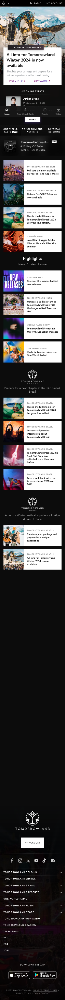
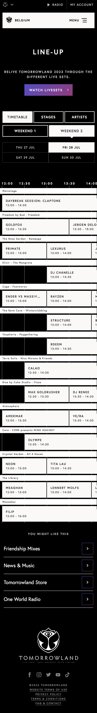
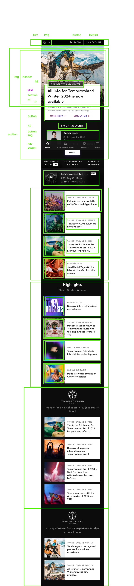

Dag Danny, 
Welkom bij mijn README! Dit is een beetje mijn process, met veel ups and DOWNS met nadruk op <DOWNS>, maar ik heb het kunnen doen met genoeg doorzettingskracht! Ik had niet echt een idee hoe erg je wilt dat ik inging op dingen, dus ik heb voor de zekerheid aan de lange kant gezeten bij mijn beschrijvingen. Als dit niet de bedoeling was, forgive me :)

## Jij

  ### Auteur:
Daniel Carvalho, ( met dikke credits naar Sep, Danny en student assintenten )

  #### Je startniveau:
Blauw

  #### Je focus:
Surface plane  :)

## Je website

  ### Je opdracht:
https://www.tomorrowland.com/home/

  #### Screenshot(s) van de eerste pagina (small screen): 
  Tommorowland 
  
   

  #### Screenshot(s) van de tweede pagina (small screen):

  
  
 

## Toegankelijkheidstest 1/2 (week 1)

  
uitwerken na test in 2e werkgroep

  ### Bevindingen
  Ik ben erachter gekomen dat mijn site NOG niet heel toegangelijk is, ik kan er nog niet heel vloeiend doorheen tabben, ik ga dit even proberen aan te passen. Ik heb nog niet heel veel content, dus heb nog niet op heel veel kunnen testen, maar voor de rest ziet het er best goed uit. 

## Breakdownschets (week 1)

  
 uitwerken na afloop 3 e werkgroep

Ik heb voor beiden een breakdownschets op papier gemaakt voordat we hier de opdracht voor kregen, had dit voor mezelf sloordig gedaan. Ik heb er wel eentje op figma gemaakt voor mijn eerste pagina, om te kijken hoe ik het ga doen met me grid etc.

  ### de hele pagina: 
  

## Voortgang 1 (week 2)

  
uitwerken voor 1e voortgang

  ### Stand van zaken
Ik heb in de eerste week mij vooral nog gefocust op de oefen opdrachten, dit heb ik gedaan omdat ik voelde dat ik heel vol stof ben kwijt geraakt van vorig jaar. Dus om even op te frissen heb ik me meer gefocussed op oefenen. Ik ben begonnen met mijn HTML langzamer hand erin te verwerken. 

  ### Agenda voor meeting
  Voor de meeting hebben we een studenten assistent naar onze code laten kijken

  | Julia          | Quirine            | Jade         | Maya             |
- Door Quirine haar feedback heb ik begrepen hoe ik lists kon stylen, dankjewel Quirine. 

  ### Verslag van meeting
  In mijn eerste meeting heb ik samen met een assistent naar mijn code gekeken, ik heb hier echt enorm veel aan gehad. We hebben gekeken naar het structuur en hoe ik bepaalde elementen zoals sections in articles beter kon verwerken. 

  - Classes aanpassen
  - Sections en divjes
  - Begin Javascript
  
  In mijn eerste meeting keek ik vooral naar de structuur, of de aller eerste basis wel klopt. 

## Voortgang 2 (week 3)

  ### Stand van zaken
  Ik heb nu meer styling, verwerkt in mijn code. Het begin komt nu samen te komen, alle imgs zijn verwerkt. Ik begin te merken dat ik meer moeite begin te krijgen met het semantisch houden van mijn code. De opdrachten gaan opzich wel goed. Ik heb in de les ondersteuning gekregen van medeleerlingen. 

  ### Verslag van meeting
 In de tweede week hebben we gekeken naar mijn code en mijn classes, ik maak heel veel gebruik van classes, dus daar moest ik een verandering aan brengen. Na afloop ben ik compleet aan het werk gegaaan met het vervangen van alle classes in mijn code met pseudo classes. Hier liep ik meteen mee vast want het was echt te lastig. 

  - Pseudo classes
  - Articles sections

## Toegankelijkheidstest 2/2 (week 4)

  
uitwerken na test in 9e werkgroep

  ### Bevindingen
  Lijst met je bevindingen die in de test naar voren kwamen (geef ook aan wat er verbeterd is):
  

## Voortgang 3 (week 4)

  
uitwerken voor 3e voortgang

  ### Stand van zaken
Ik loop enorm vast met javascript, ik snap er niet heel veel van, ook al heb ik alle oefeningen gevolgd. Ik ga echt stap voor stap verder, alleen het ritme moet omhoog om het te kunnen halen. Ik ben begonnen met mijn javascript voor mijn scroll animatie, en het is best wel lastig, maar ik heb er hoop in want ik begin begrijp ik wel volledig. Verder ben ik begonnen aan mijn tweede pagina en heb ik met ondersteuning mijn timeline kunnen maken. Dankjewel Sep en Mike, toppers! 

  ### Agenda voor meeting
  Mijn groepje heeft zich helaas niet gehouden aan het schema, en we gingen individueel, ik heb wel heel veel feedback gekregen van andere mede studenten over hoe bepaalde erros uit mijn code kon halen, zoals in de doctype en in mijn header. 

  ### Verslag van meeting
In de derde meeting heb ik besproken hoe ik mijn 5 surface plane punten afmaak, Hierbij heb ik gekeken naar hoe ik de dark-mode ga toevoegen en hoe ik ervoor ga zorgen dat audio afspeelt op mijn site. 
  - Dark-mode
  - Javascript errors
  - Party-mode
  - Video

## Eindgesprek (week 5)

  
 uitwerken voor eindgesprek 

  ### Dit ging goed/Heb ik geleerd: 
  Ik ben enorm blij met mijn resultaat, ik had nooit gedacht in 100 jaar dat ik zo een site in elkaar zou kunnen zetten en het is me gewoon gelukt. Ik ben enorm blij, ik ben zo erg gegroeid in coderen het is echt niet normaal. In dit vak alleen, ik was begin dit vak de meest basic dingen van html vergeten en nu heb ik zulke complexe js geschreven. Ik ben enorm trots op mezelf en hoop dat ik iets goeds heb neergezet. Ik heb voor de laatste week tot 2/3 snachts gewerkt elke dag, om het af te kunnen krijgen. Ik heb heel lang vast gelopen met kleine dingen in het begin en het opfrissen van de code door opdrachten te maken, dat ik daarna pas goed kon beginnen. Dit is by far het meest intensieve vak dat ik op deze hele opleiding heb gehad, maar ik ben er dankbaar voor want het heeft alles uit me gehaald, inclusief tranen. 

  ### Dit was lastig/Is niet gelukt:
Omdat ik heel lang stil stond bij een java script probleem in de laatste dagen, is het me niet gelukt om simpelweg mijn line-up pagina te javascripten. Ik heb er wel een easter egg in gestopt, was niet helemaal de bedoeling maar is alles wat de studenten assistent heeft kunnen doen (sorry ben de naam vergeten van die blonde jongen). 

  

## Bronnenlijst

  
continu bijhouden terwijl je werkt

  Nb. Wees specifiek ('css-tricks' als bron is bijv. niet specifiek genoeg). 
  Nb. ChatGpT en andere AI horen er ook bij.
  Nb. Vermeld de bronnen ook in je code.

  1. bron 1
  2. bron 2
  3. ...

